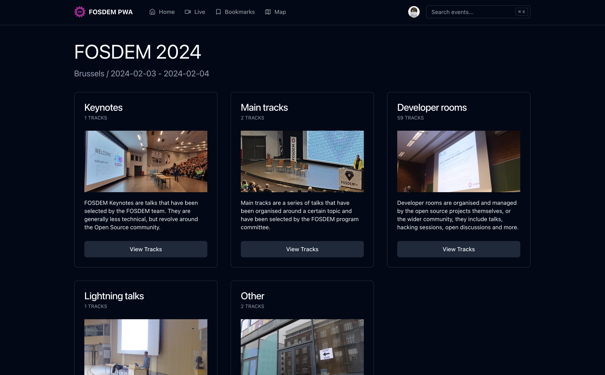
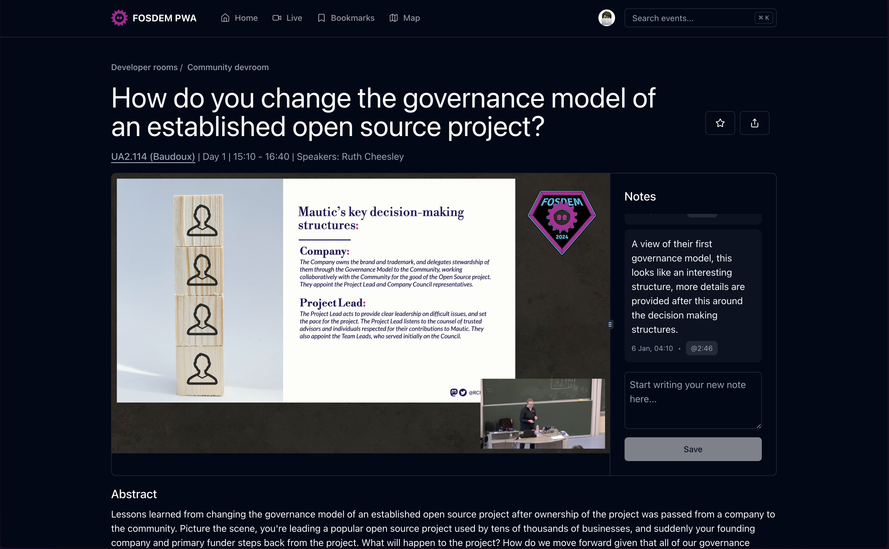
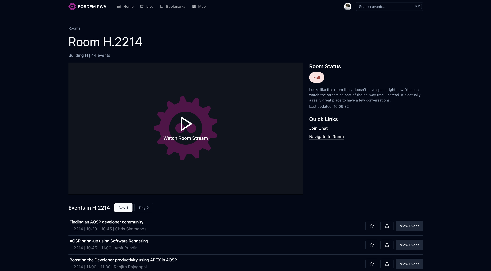
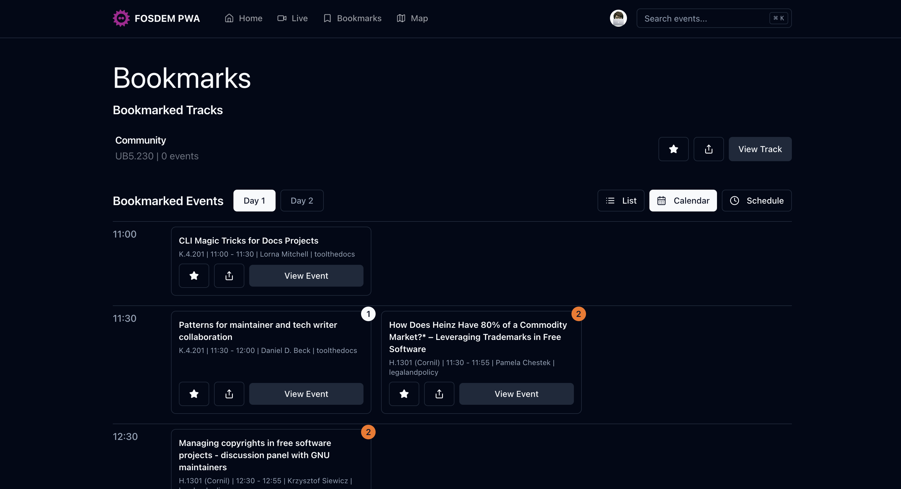
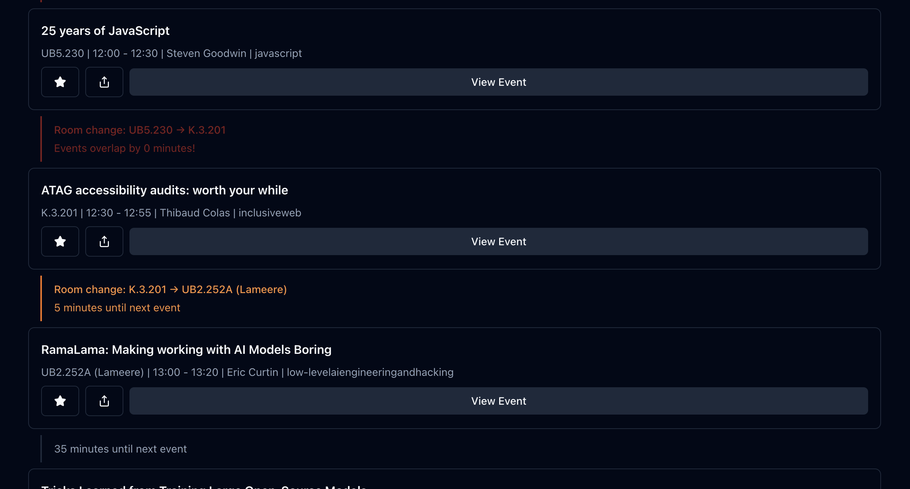
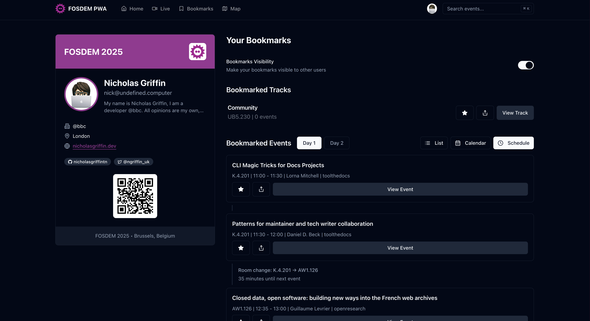

# FOSDEM PWA Companion App

This is a companion app for [FOSDEM](https://fosdem.org/), built with [TanStack Start](https://tanstack.com/start/) and using [the shadcn UI library](https://ui.shadcn.com/), it is a PWA that can be installed on your phone or desktop, or just used as a website.

It is mostly a passion project to get a chance to play with some other technologies, alongside that, I personally attend FOSDEM, a lot of the features in this app are to make my experience better, such as tracking sessions I want to attend, taking notes, and sharing my bookmarks.

Also, this project is heavily inspired by [sojourner-web](https://github.com/loomchild/sojourner-web/tree/master), so huge props to them!

## Check it out

You can check out the app at [https://fosdempwa.com/](https://fosdempwa.com/)

## Features

|  |
|:--:|
| **Homepage & Navigation**   • Quickly access scheduled tracks including Keynotes, Main tracks, Developer rooms, Lightning talks, and Other events   • Powerful search feature to locate events, tracks, rooms, and more   • Automatic data sync from FOSDEM for latest information |

|  |
|:--:|
| **Event Details & Note Taking**   • Detailed event information   • Capture and save session insights to through notes with timestamps   • GitHub sign in for a personalized experience |

|  |
|:--:|
| **Room & Live Features**   • An events list for each room   • Continuous live stream view   • Dedicated page for live sessions |

|  |
|:--:|
| **Smart Bookmarking**   • Bookmark your favorite tracks and events   • Priority settings for conflict detection   • Consolidated bookmark view |

|  |
|:--:|
| **Track Management**   • List of events per track   • <ap for venue navigation   • Track and event sharing |

|  |
|:--:|
| **User Features**   • Personal profile page with generated event pass   • Share bookmarks with others   • Collaborative planning capabilities |

*Data sync service deployed separately: [Build Data Repository](https://github.com/nicholasgriffintn/fosdem-pwa-build-data)*

## TODO

- [ ] Add bookmark status from DB to the event page.
- [ ] Allow users to search within specific tracks or time slots
- [ ] Maybe a calendar export? Is that too hard?
- [ ] Make Fosdem PWA a PWA again (this is mostly done but not precaching routes so only works SPA)
- [ ] Bookmarks and Notes are background synced when offline (I've not validated this yet)
- [ ] Guest sign in (potentially)
- [ ] Configure push notifications, will need a new database table (SW work has been started for this)
- [ ] Send notifications for bookmarked events (should be configurable)
- [ ] Add a track progress feature? https://capture.dropbox.com/tmn4M77IN4F7IJUl
- [ ] Maybe a visual indicator for progress?: https://capture.dropbox.com/YiTleZxrLM539GKc
- [ ] Add personalised recommendations based on bookmarks? Maybe could give users the ability to st their interests? https://capture.dropbox.com/2UZpDyZp0R2YcKDn
- [ ] Maybe we could put the events in Vectorize and then have a RAG AI suggest events? This would also include notes, would need to be personalised to the user, maybe with namespaces?

## Contributing

If you want to contribute to this project, please read the [CONTRIBUTING.md](CONTRIBUTING.md) file.
