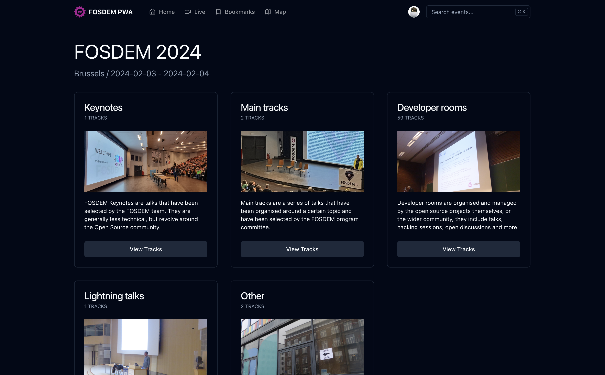
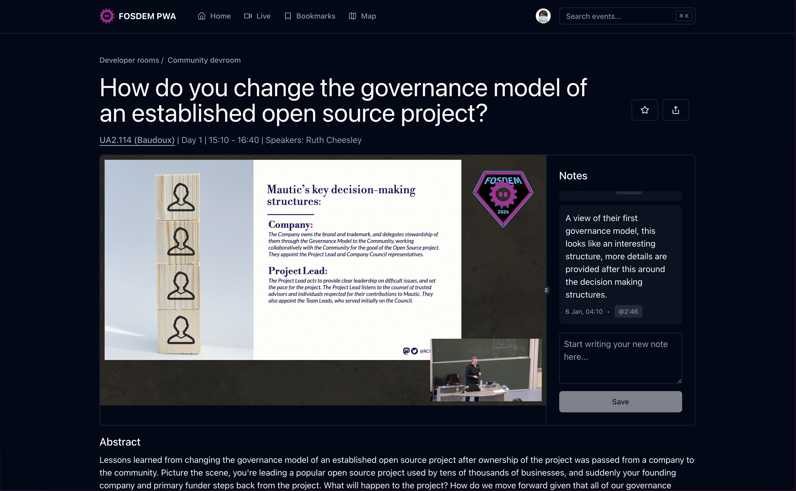
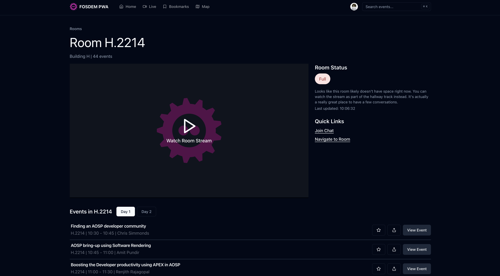
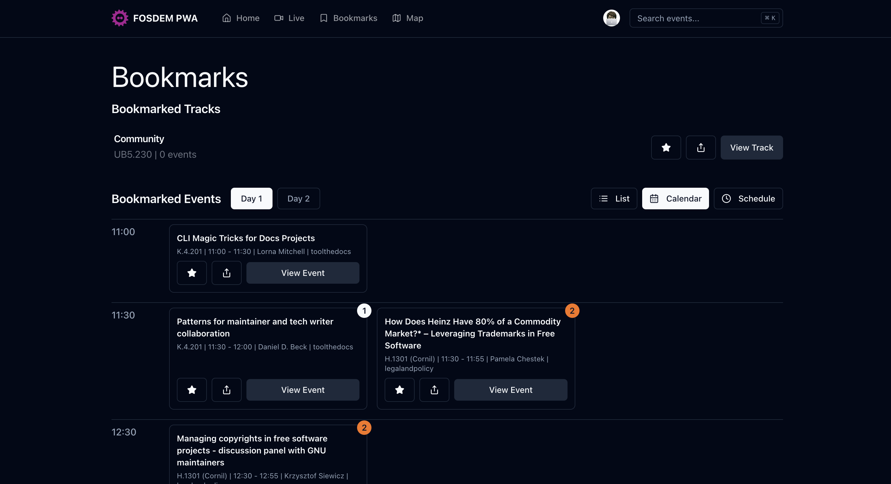
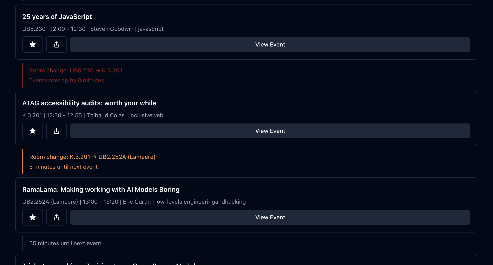
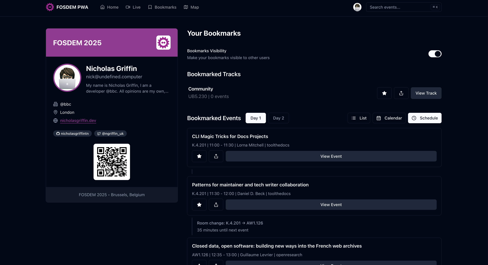

# Room is Full


Room is Full has been designed to be a companion app that can be deployed individually per conference that I might want an app for.

This allows me to plan where i'm going to, bookmark any talks that I am interested in, take notes in sessions and share my schedule with other people going. As a PWA (Progressive Web App), it works across my devices and live syncs over apis.

## Conferences

- [https://fosdempwa.com/](https://fosdempwa.com/)

## Deploy

| Environment | Canonical domain | Redirects from |
| --- | --- | --- |
| Default | `roomisfull.app` | `roomisfull.com` and their `www` hosts |
| `fosdem` | `fosdempwa.com` | `fosdem.roomisfull.app` and `www.fosdempwa.com` |

Run from the repository root to build and deploy the directory:

```sh
pnpm build
pnpm --filter @roomisfull/web run deploy
```

Build and deploy FOSDEM separately:

```sh
CLOUDFLARE_ENV=fosdem pnpm build
pnpm --filter @roomisfull/web run deploy
pnpm --filter @roomisfull/build-data run deploy --env fosdem
pnpm --filter @roomisfull/push run deploy --env fosdem
```

## Features

<div style="display: grid; grid-template-columns: repeat(2, 1fr); gap: 20px;">

|  |
|:--:|
| **Homepage & Navigation** <br> • Quickly access scheduled tracks including Keynotes, Main tracks, Developer rooms, Lightning talks, and Other events <br> • Powerful search feature to locate events, tracks, rooms, and more <br> • Automatic data sync from FOSDEM for latest information |

|  |
|:--:|
| **Event Details & Note Taking** <br> • Detailed event information <br> • Capture and save session insights to through notes with timestamps <br> • GitHub sign in for a personalized experience |

|  |
|:--:|
| **Room & Live Features** <br> • An events list for each room <br> • Continuous live stream view <br> • Dedicated page for live sessions |

|  |
|:--:|
| **Smart Bookmarking** <br> • Bookmark your favorite tracks and events <br> • Priority settings for conflict detection <br> • Consolidated bookmark view |

|  |
|:--:|
| **Track Management** <br> • List of events per track <br> • <ap for venue navigation <br> • Track and event sharing |

|  |
|:--:|
| **User Features** <br> • Personal profile page with generated event pass <br> • Share bookmarks with others <br> • Collaborative planning capabilities <br> • Sign in is not required unless you want to sync your data across devices or share |

</div>

## Why did you build this?

The FOSDEM website is great, but it lacks some features that I wanted to make my conference experience better.

One of the biggest things it is missing is the ability to bookmark events and build a personal schedule. I find this capability super useful for this conference as there are so many events happening at the same, across a lot of rooms.

Alongside that, I wanted the ability to take notes during sessions and share my schedule with friends, so they can see what I am planning to attend, and we can coordinate better.

Finally, I wanted to build a PWA using some of the latest web technologies, and this seemed like a fun project to work on.

## Credits

This project uses the FOSDEM public API to fetch event data. Thanks to the FOSDEM team for making this data available!

This project is heavily inspired by [sojourner-web](https://github.com/loomchild/sojourner-web/tree/master), so huge props to them!

Finally, I built this with [TanStack Start](https://tanstack.com/start/) and used [the shadcn UI library](https://ui.shadcn.com/) for the components.

## Contributing

If you want to contribute to this project, please read the [CONTRIBUTING.md](CONTRIBUTING.md) file.
